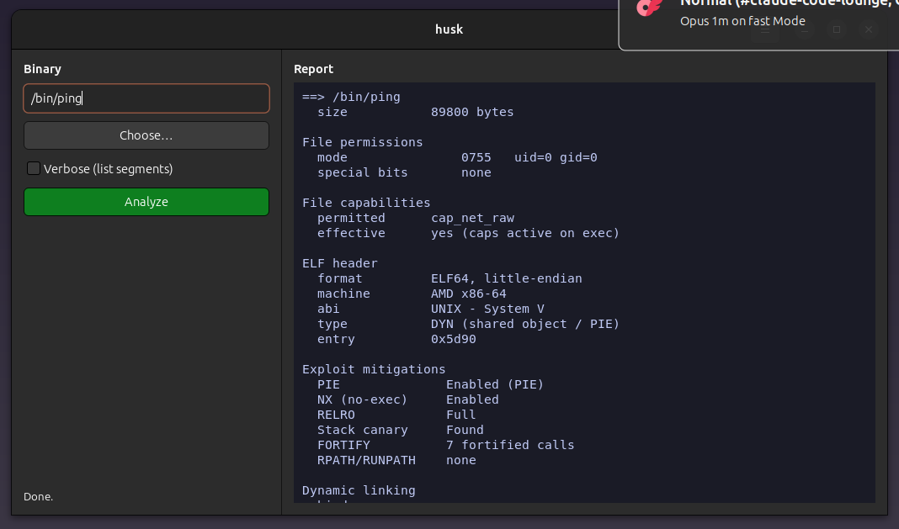

<div align="center">

# husk

**Read-only ELF / permissions / capability inspector** — tells you what a binary *is* without ever running it.

<a href="https://github.com/effjy/husk"></a>


</div>

---

`husk` parses an ELF binary straight from its bytes — no `libelf`, no `libcap`, no `binutils` — and reports its security posture. The target is only ever opened `O_RDONLY` and read into memory: **husk performs no writes and never maps the file executable.** It's the static, never-execute companion to the forensics line (`fordump`, `frecover`, `sift`), and answers the question `warden` can't: *what is this binary, before I let it run?*

It ships as a **CLI** (`husk`) and a **GTK4 desktop frontend** (`husk-gui`) — pick a binary on the left, read the report in a Tokyo-Night log on the right.

<div align="center">
  <br>
  
  <br>
  <sub><i>husk-gui — choose a binary on the left; the read-only report appears in the log on the right.</i></sub>
</div>

---

## What it reports

- **ELF header** — class (32/64), endianness, ABI, machine, type (`EXEC` / `DYN`/PIE / `REL` / `CORE`), entry point.
- **On-disk permissions** — octal mode, owner/group, and red-flags for **setuid** (with explicit *setuid root*), **setgid**, sticky and **world-writable** bits.
- **POSIX file capabilities** — decoded straight from the `security.capability` extended attribute: permitted/inheritable cap sets by name (e.g. `cap_net_raw`, `cap_sys_admin`) and whether they're **effective** on exec.
- **Exploit mitigations** — **PIE**, **NX** (`GNU_STACK`), **RELRO** (partial vs full via `BIND_NOW`), **stack canary**, **FORTIFY**, **RPATH/RUNPATH**, `TEXTREL`, and any **W+X** segment or section.
- **Dynamic linking** — `SONAME`, `BIND_NOW`, and every `DT_NEEDED` shared library.
- **Noteworthy imports** — classic risky libc calls present in the symbol tables (`system`, `execve`, `gets`, `strcpy`, `mktemp`, weak RNG, …).

Handles 32- and 64-bit, little- and big-endian, and stripped binaries (dynamic-segment parsing still recovers mitigations and dependencies when section headers are gone). Malformed or truncated files are reported, never crashed on.

---

## Prerequisites

The **CLI** needs only a C++17 compiler and libc. The **GUI** additionally needs GTK4 and `pkg-config`.

**Debian / Ubuntu**

```sh
sudo apt install build-essential pkg-config libgtk-4-dev
```

**Fedora**

```sh
sudo dnf install gcc-c++ pkgconf-pkg-config gtk4-devel
```

**Arch**

```sh
sudo pacman -S --needed base-devel gtk4
```

> Only building the CLI? You can skip the GTK4 package and run `make cli`.

## Build

Both binaries are built from a single Makefile:

```sh
make            # builds husk (CLI) and husk-gui (GUI)
make cli        # builds only the CLI
make gui        # builds only the GUI
```

## Install

```sh
sudo make install      # installs both globally + icon + .desktop entry
```

This installs:

| What | Where |
|:--|:--|
| `husk`, `husk-gui` | `/usr/local/bin/` |
| icon (PNG + SVG) | `/usr/share/icons/hicolor/{256x256,scalable}/apps/husk.*` |
| desktop entry | `/usr/share/applications/husk.desktop` |

The icon and desktop caches are refreshed automatically, so **husk** shows up in your
application menu and taskbar with its own icon, and `husk` / `husk-gui` are on your `PATH`.

Remove everything with:

```sh
sudo make uninstall
```

---

## Usage

### GUI

Launch **husk** from your application menu (or run `husk-gui`). Click **Choose…**, pick a
binary, and the report appears on the right. Tick **Verbose** to also list every loadable
segment. The GUI only ever spawns the read-only `husk` core — it never executes your target.

### CLI

```
husk [options] <file> [file...]

  -a, --all        verbose (also list every loadable segment)
      --no-color   disable ANSI colour
  -h, --help       show this help
```

```sh
husk /bin/ping            # see its cap_net_raw capability
husk --all ./suspicious   # full segment dump + mitigations
husk /usr/bin/*           # sweep a directory
```

#### Example

```
==> /bin/ping
File capabilities
  permitted      cap_net_raw
  effective      yes (caps active on exec)

Exploit mitigations
  PIE              Enabled (PIE)
  NX (no-exec)     Enabled
  RELRO            Full
  Stack canary     Found
  FORTIFY          7 fortified calls
  RPATH/RUNPATH    none
```

---

## License

MIT — © 2026 Jean-Francois Lachance-Caumartin
